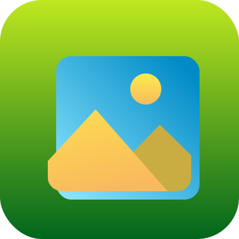

## MY NFT Gallery

Turn your ENS into your personal NFT gallery and invite friends to visit it online.

### What is it?

This app allows you to host your personal NFT gallery on your ENS domain.  
For people who already have something on their ENS domains there is an option to host the gallery on a subdomain,
e.g. `gallery.vitalik.eth`

### How does it work?

1. User logins with his/her wallet
2. If user doesn't have ENS domain, there is an option to buy
3. User selects preferred domain and has an option to setup `gallery.<select_domain>` subdomain for the gallery
4. The app uses few providers to get NFT data from different chains (QuickNode, Covalent, NFTPort)
5. User selects NFTs that he/she wants to show in his gallery
6. Static page with selected NFTs is generated and deployed to IPFS
7. IPFS url is set as content hash to selected ENS domain/subdomain
8. User can invite his/her web2 friends to visit his NFT gallery using `<selected_domain>.link`